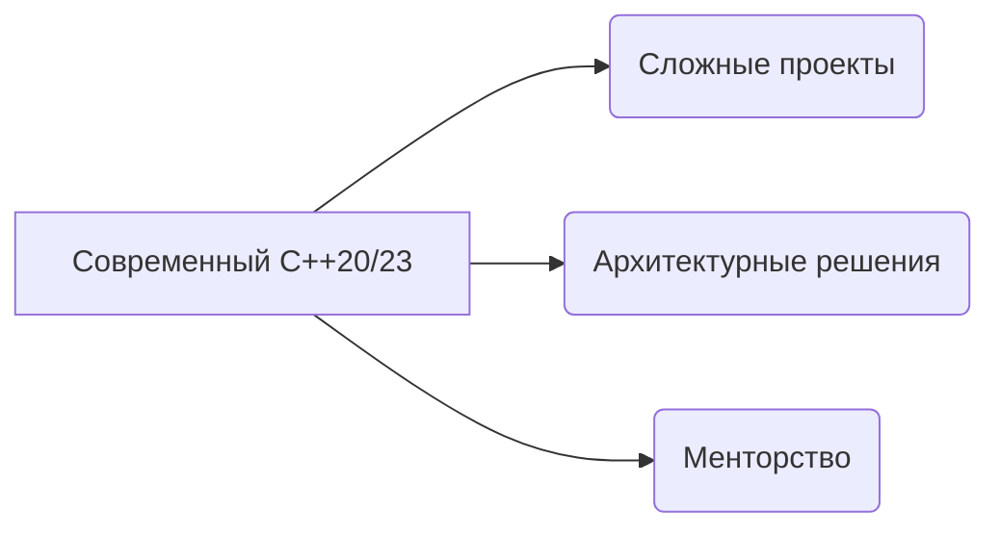

### 👋 Привет! Я Александр, C++/Qt разработчик
<div align="left">
  
</div>

<div align="left" style="margin: 15px 0;">
    
[](https://t.me/kaacpp)
[](mailto:k92.a@ya.ru)
</div>

### 👨💻 О себе
**C++/Qt разработчик** с 2+ годами коммерческого опыта. Специализируюсь на:

```cpp
enum class Specialization {
    DesktopApps = 0x01,    // Qt Widgets/QML
    CrossPlatform = 0x02,  // Windows/Linux
    HighPerformance = 0x04 // STL/Алгоритмы
};
```
### 🔍 Активно изучаю:

**📚 Основные направления:**  
**Оптимизация Qt-приложений** (QProfiler, замеры производительности)  
**Многопоточное программирование** (QThreadPool, std::async, атомарные операции)  
**Интеграция Python в C++** (PyBind11, вызов скриптов из Qt)  
 
Qt Quick 3D для визуализации данных  
Modern CMake (target-based подход)  
Микросервисная архитектура для десктопных приложений  

### 🎯 Мои цели


## 📫 Контакты:
- **Telegram:** [](https://t.me/kaacpp) — отвечаю в течение часа
- **Email:** [](mailto:k92.a@ya.ru) — для формальных предложений
- **GitHub:** [](https://github.com/yourusername)
